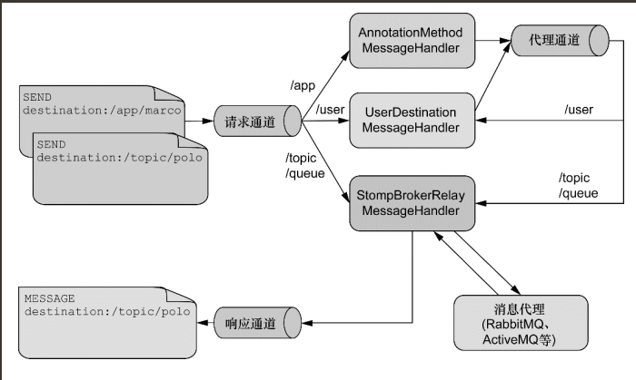

## WebSocket
### HTTP Versus WebSocket
- Even though WebSocket is designed to be HTTP-compatible and starts with an HTTP request, it is important to understand that the two protocols lead to very different architectures and application programming models.

- In HTTP and REST, an application is modeled as many URLs. To interact with the application, clients access those URLs, request-response style. Servers route requests to the appropriate handler based on the HTTP URL, method, and headers.

- By contrast, in WebSockets, there is usually only one URL for the initial connect. Subsequently, all application messages flow on that same TCP connection. This points to an entirely different asynchronous, event-driven, messaging architecture.

- WebSocket is also a low-level transport protocol, which, unlike HTTP, does not prescribe any semantics to the content of messages. That means that there is no way to route or process a message unless the client and the server agree on message semantics.

- WebSocket clients and servers can negotiate the use of a higher-level, messaging protocol (for example, STOMP), through the Sec-WebSocket-Protocol header on the HTTP handshake request. In the absence of that, they need to come up with their own conventions.

### When to Use WebSockets
- WebSockets can make a web page be dynamic and interactive. However, in many cases, a combination of Ajax and HTTP streaming or long polling can provide a simple and effective solution.

- For example, news, mail, and social feeds need to update dynamically, but it may be perfectly okay to do so every few minutes. Collaboration, games, and financial apps, on the other hand, need to be much closer to real-time.

- Latency alone is not a deciding factor. If the volume of messages is relatively low (for example, monitoring network failures) HTTP streaming or polling can provide an effective solution. **It is the combination of low latency, high frequency, and high volume that make the best case for the use of WebSocket.**

- Keep in mind also that over the Internet, restrictive proxies that are outside of your control may preclude WebSocket interactions, either because they are not configured to pass on the Upgrade header or because they close long-lived connections that appear idle. This means that the use of WebSocket for internal applications within the firewall is a more straightforward decision than it is for public facing applications.

## SockJS Fallback
- Over the public Internet, restrictive proxies outside your control may preclude WebSocket interactions, either because they are not configured to pass on the Upgrade header or because they close long-lived connections that appear to be idle.

- The solution to this problem is WebSocket emulation — that is, attempting to use WebSocket first and then falling back on HTTP-based techniques that emulate a WebSocket interaction and expose the same application-level API.

- On the Servlet stack, the Spring Framework provides both server (and also client) support for the SockJS protocol.

- The goal of SockJS is to let applications use a WebSocket API but fall back to non-WebSocket alternatives when necessary at runtime, without the need to change application code.

- The SockJS client begins by sending GET /info to obtain basic information from the server. After that, it must decide what transport to use. If possible, WebSocket is used. If not, in most browsers, there is at least one HTTP streaming option. If not, then HTTP (long) polling is used.

- SockJS is designed for use in browsers. It uses a variety of techniques to support a wide range of browser versions. 

## STOMP
- The WebSocket protocol defines two types of messages (text and binary), but their content is undefined. The protocol defines a mechanism for client and server to negotiate a sub-protocol (that is, a higher-level messaging protocol) to use on top of WebSocket to define what kind of messages each can send, what the format is, the content of each message, and so on. The use of a sub-protocol is optional but, either way, the client and the server need to agree on some protocol that defines message content.

- STOMP (Simple Text Oriented Messaging Protocol) was originally created for scripting languages (such as Ruby, Python, and Perl) to connect to enterprise message brokers. It is designed to address a minimal subset of commonly used messaging patterns. STOMP can be used over any reliable two-way streaming network protocol, such as TCP and WebSocket. Although STOMP is a text-oriented protocol, message payloads can be either text or binary.

- 

- spring websocket利用STOMP作为websocket的子协议，原因是stomp可以提供一种类似spring mvc的编码方式，可以利用注解进行接收和发送消息以及和spring mvc进行无缝的结合。

- Detailed Stomp.js API see https://stomp-js.github.io/stomp-websocket/codo/class/Client.html